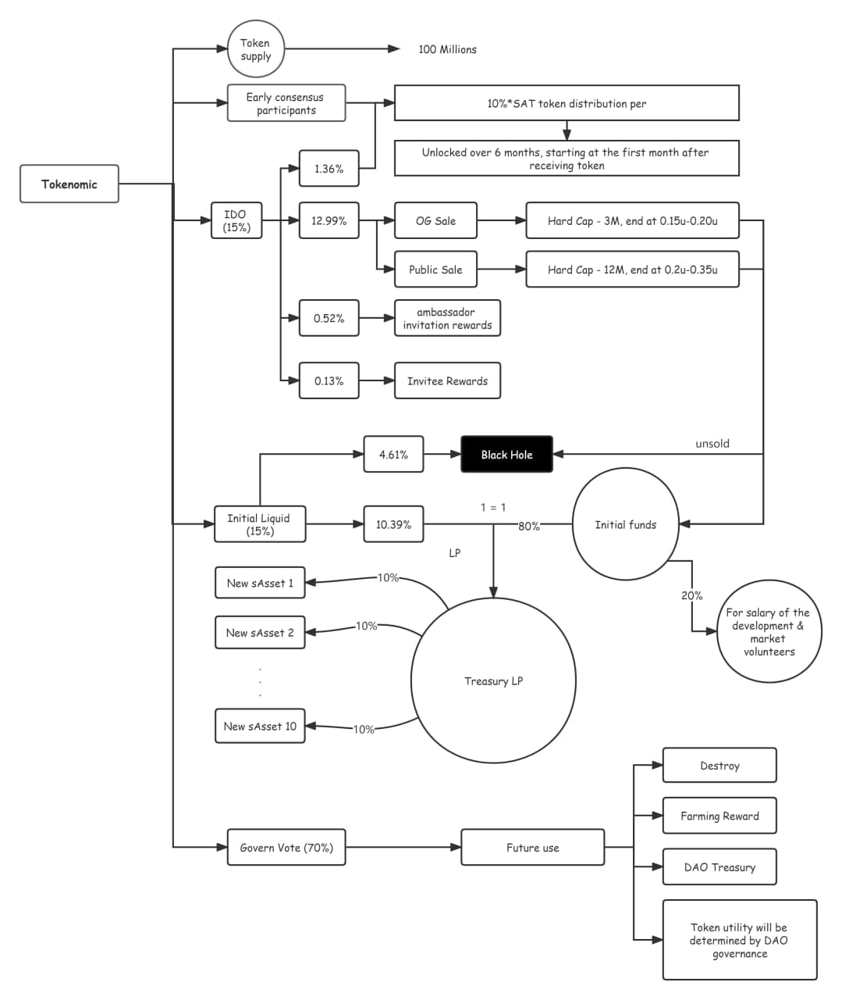

#  Smart Contracts

##  🔧 Setting up local development

Requirements:
- [Node v14](https://nodejs.org/download/release/latest-v14.x/)  
- [Git](https://git-scm.com/downloads)

Local Setup Steps:
1. ``git clone https://github.com/synassets/contracts.git ``
1. Install dependencies: `npm install` 
    - Installs [Hardhat](https://hardhat.org/getting-started/) and [OpenZepplin](https://docs.openzeppelin.com/contracts/4.x/) dependencies
1. Compile Solidity: ``npm run compile``

## 🤔 How it all works

## Contract addresses

### Mainnet

Network: `Polygon`

- TestSAT: `0x8d727C3D99892b285dD7F0D7268E6cE850532E47`
- TestUSDC: `0x70b04a9AbC8D0D2088a3D0895aD3a6363859592f`
- TokenSale-OG: `0xB1601bF2D7FE00d24ccb4037F5D87b7664b19c7e`
- TokenSale-PUB: `0xdCde2c8CC76f9C40f439e294843D9c7DaB7a2A5e`
- Timelock: `0xd4d8FfaC785d14e2e34afFe92193202c3543c0d8`